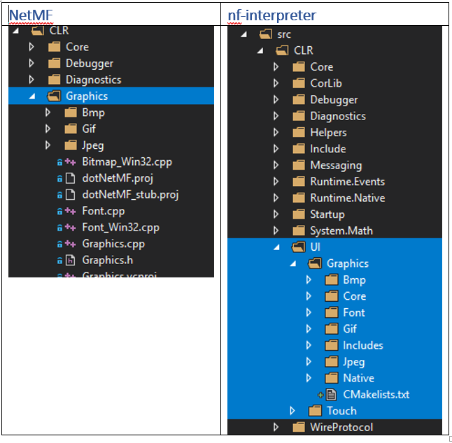
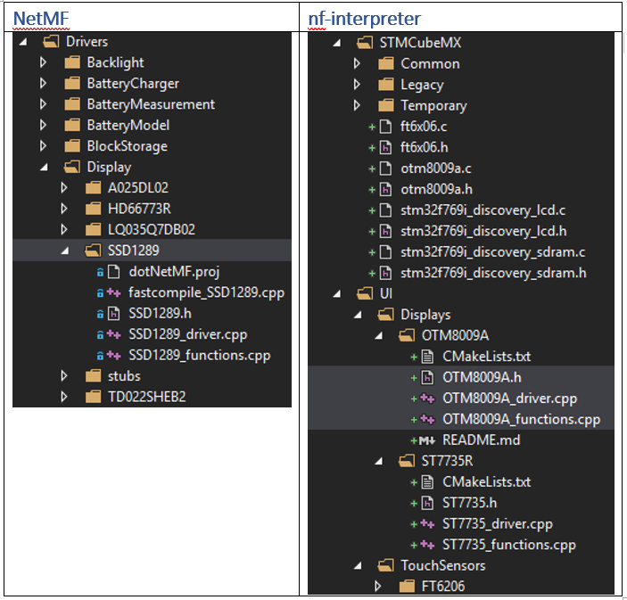
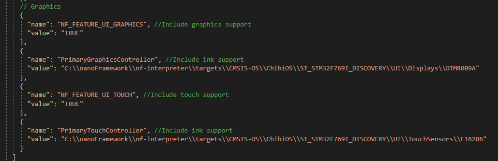

##### Current progress in migration of graphics from netmf to nanoframework

Common low-level graphics/touch ink code from net-mf to nf-intepreter
 

##### Low level display drivers

Copied net-mf display driver SSD1289 to nf-interpreter and altered to compile but not currently working or tested.
 

### Configuration 

#### Code added to main CMakeLists.txt ( bottom)
 `User Interface (UI) code` 
`if(NF_FEATURE_UI_GRAPHICS)` 
   `add_subdirectory(src/CLR/UI/Graphics)` 
   `add_subdirectory("${PrimaryGraphicsController}")` 
`endif()` 

`if(NF_FEATURE_UI_TOUCH)` 
   `add_subdirectory("${PrimaryTouchController}")` 
`endif()` 

### Definitions added to CMakeSettings.json

