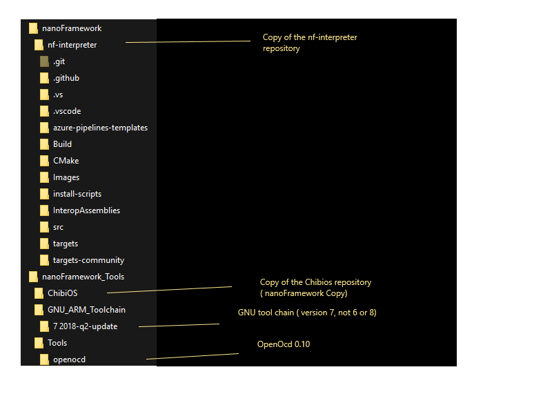

### Developing firmware for the nanoframework using Visual Studio 2017 community edition 

##### 🚧 IMPORTANT : The firmware build for Visual Studio is under construction. 🚧 
Some compromises were required to get this to a working stage.
I made a decision to put the code at the top level to reduce path length of files which caused warnings of the potential to overflow the command line.
>Hard coded paths are used to ensure it works with the current CMake coding and the Microsoft usage of CMake
>There are some issues with the CMakeSettings.json file with path separators.

 

### Directory structure for the project
Two top level directories have been created to support the development with Visual Studio.
* `c:\nanoFramework\nf-interpreter`
* `c:\nanoFramework_Tools`

#### c:\nanoFramework\nf-interpreter
- The nf-interpreter repository is cloned to this directory.
######  c:\nanoFramework\nf-interpreter\Build
- This directory contains the build output, the files in here are transient. When the CMake cache is deleted, files in this directory are deleted.
The files in this directory are only visible when selecting "Show All Files". These files are not part of the GIT repository.
At the end of a successful build the build outputs are copied to the *\Build* directory.

> - Note: It is sometimes necessary to delete the contents of these folders if Visual Studio misbehaves.
Using Visual Studio with CMake results in what appears to be inconsistencies at times.
Sometime the CMake server goes away, shutting down Visual Studio and restarting usually fixes the problem.
 
> - Note: After clearing the Cmake cache, on occassions the build/chibios_source directory is left empty or only containing the .git file
>due to some conflict. The current CMakeLists.txt file finds the directory and does not re-copy the code.
>It is necessary to manually delete the directory from file explorer and generate the cache for the copy to run.
>_

#### c:\nanoFramework_Tools\
 Manually create this directory to contain the following folders.
###### c:\nanoFramework_Tools\ChibiOS
+ Copy of the ChibiOS repository cloned from https://github.com/nanoframework/chibios.git

######  C:\nanoFramework_Tools\Tools\openocd
+ Copy of the openocd installation http://www.freddiechopin.info/en/download/category/4-openocd
+ > Currently version 0.10.0

###### C:\nanoFramework_Tools\Tools\
+ Place a copy of the hex2dfu.exe tool here

### Example of the directory structure

### Major configuration files

##### CMakeSettings.json
> Configuration file used by Visual Studio. This is the standard configuration file for CMake development.
> This file can contain more than one configuration. In addition to setting the compiler
> toolchain, additional variables are defined to select the target hardware and operating system to build.
>###### Note: Work in progress
 

##### CMakeLists.txt
> This is the standard CMakeLists.txt file for the nf-intepreter

 

##### launch.vs.json
> Sets up the debugging environment using the gdbserver debugging via configurations.
> The example references the openocd application.

 

#### Setup and Installation

| Software Component | Notes | Link |
|:-|---|---|
| Visual Studio 2017 community edition |Linux development with C++|
|option|Visual C++ tools for Cmake and Linux   
|option|Embedded and IoT Development|GCC version 6.3.1. December/2018
|GCC Tool Chain - Version 7-2018-q2-update|GNU Arm Embedded Toolchain|https://developer.arm.com/open-source/gnu-toolchain/gnu-rm/downloads#

#### GCC Toolchain NOTES
> Version 6.3.1 installed by Visual Studio has a problem with fallthrough, Version 8, has a problem with structures ( an issue has been raised to fix this)
 
The following GCC version has been download, installed and tested.
>    GNU Arm Embedded Toolchain - Version 7-2018-q2-update 
    https://developer.arm.com/open-source/gnu-toolchain/gnu-rm/downloads#

In CMakeSettings.json the following variables determine the build tool.

        {
          "name": "TOOLCHAIN_PREFIX",
          "value": "C:/Program Files (x86)/GNU Tools Arm Embedded/7 2018-q2-update"
          // "value": "${env.GCCPATH}"   // Standard Visual Studio Install of GCC 6.3.1 
        },

In CMakeSettings.json the VISUAL_STUDIO variable sets up a workaround for a problem with the build system.
If you use the `add_custom_command` with `POST_BUILD` then the build compiles but does not link due to a 'cmd.exe' not recognized'

        {
          "name": "VISUAL_STUDIO",
          "value": "TRUE"
        },
To avoid the problem the custom command to copy the build outputs is not run.
 An equivalent of this can be run by executing `CopyBuildOutput.cmd` manually from the command prompt.
 
 
#### Debugging

The launch.vs.json file contains an example configuration for setup to debug the STM32769IDiscovery board. 
Additonal configurations can be added, although the implementation of the options does not seem consistent with
the VSCODE version and some options do not appear to work properly. 
Also, the whole system is a bit flakey. The openocd program is run as sub process of Visual Studio,and if it runs into problems the 
system fails, and you must run up task manager to end the openocd.exe task listed as a process of Visual Studio.

#### Diagnosing problems with the debug and launch.vs.json

You can get a better understanding of problems that may be occuring with the gdb/openocd debug setup.
In Visual Studio select the Command Window Ctrl+Alt+A, and turn on debug logging with the following command.

`debug.midebuglog /On:c:\Temp\debug.log`

Run a debugging session to collect data and turn it off with the following command.

`debug.midebuglog /Off`

This will give you a log of the operation and communications occuring. ( Good luck!)

__*An example snippet displays error for "Monitor reset halt ( not quite sure why?)*__

        8: (1976730) ->^done
        8: (1976730) <-1005-interpreter-exec console  "monitor reset halt"
        8: (1976730) ->(gdb)`
        8: (1976741) ->&"\"monitor\" command not supported by this target.\n"
        8: (1976742) ->1005^error,msg="\"monitor\" command not supported by this target."
        8: (1976742) ->(gdb)
        8: (1976742) 1005: elapsed time 11
        8: (1976742) <-1006-interpreter-exec console "monitor reset init"
        8: (1976742) ->&"\n"
        8: (1976742) ->^done
        8: (1976742) ->(gdb)

#### Feedback 

If you are using this your feedback is greatly appreciated. Please join our [Discord community](https://discord.gg/gCyBu8T) and start chatting about this.
