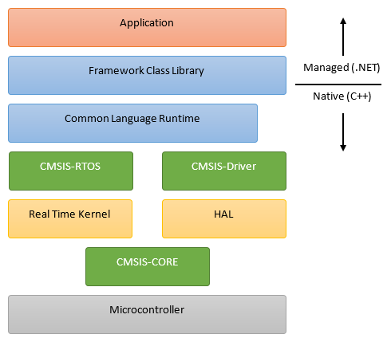

# Architecture

> Note: Work in progress, subject to change

The following diagram illustrates the basic nano Framework layers:

> Important Note: The above diagram applies to the initial version of nano Framework,
which focuses on [CMSIS](http://www.keil.com/pack/doc/CMSIS/General/html/index.html)-compatible
real-time operating systems (RTOS). While the use of RTOS enables some advanced
scenarios, it is not mandatory - the CMSIS API (green) and the Real Time Kernel
can be replaced with a thin PAL and a bare-metal CPU support, respectively.

## Layers (bottom-up)

### Physical Hardware

The nano Framework is portable to any CMSIS-compatible RTOS with minimal effort.

#### Hardware Requirements

> TODO: Move to a separate Hardware Requirement page (RTOS-specific ?)

The nano Framework does not require any virtual memory or Memory Management Unit
(MMU).

The minimal hardware requirement for the nano Framework runtime are:
* A timer (16-bit or more)
    * Either a specialized SysTick or a general purpose timer, if running in tickless-mode,
* At least FIXME: xxx bytes of RAM,
* At least FIXME: xxx bytes of flash memory,

### CMSIS-CORE

[CMSIS-CORE](http://www.keil.com/pack/doc/CMSIS/Core/html/index.html) API implements
the basic runtime system for a Cortex-M device and provides access to the processor
core and the device peripherals.

### Hardware Abstraction Layer (HAL)

This layer, as the name implies, is responsible for abstracting out the hardware
from the rest of the system. It provides standardized definition and low level
drivers for the core perihperals, such as SysTick, interrupt controller, various
hardware perihperals etc.

> Note: In the initial implementation of nano Framework, the HAL is provided
either by the RTOS or an external library.

